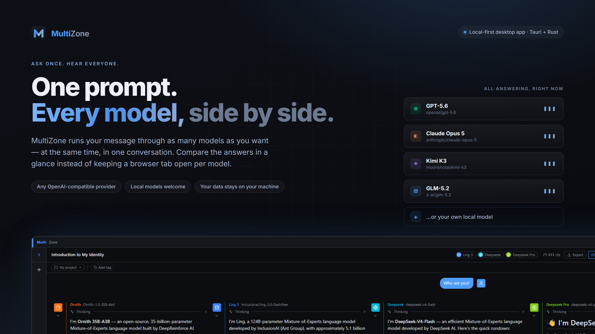
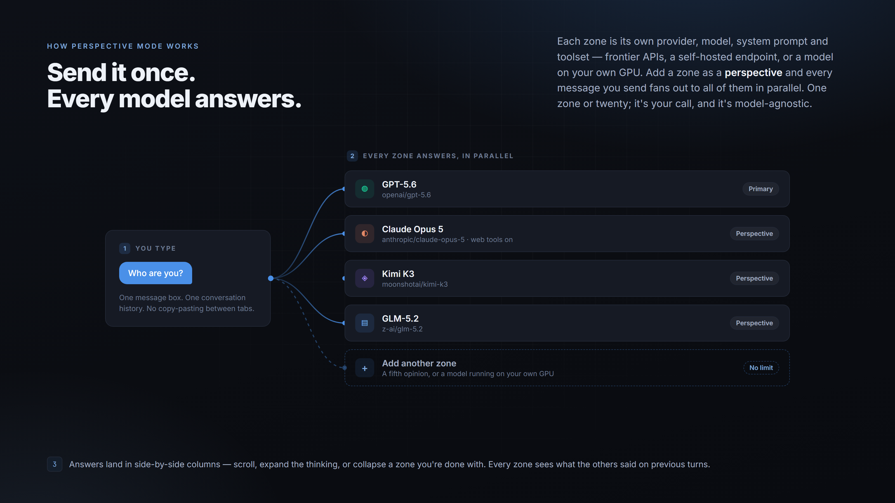
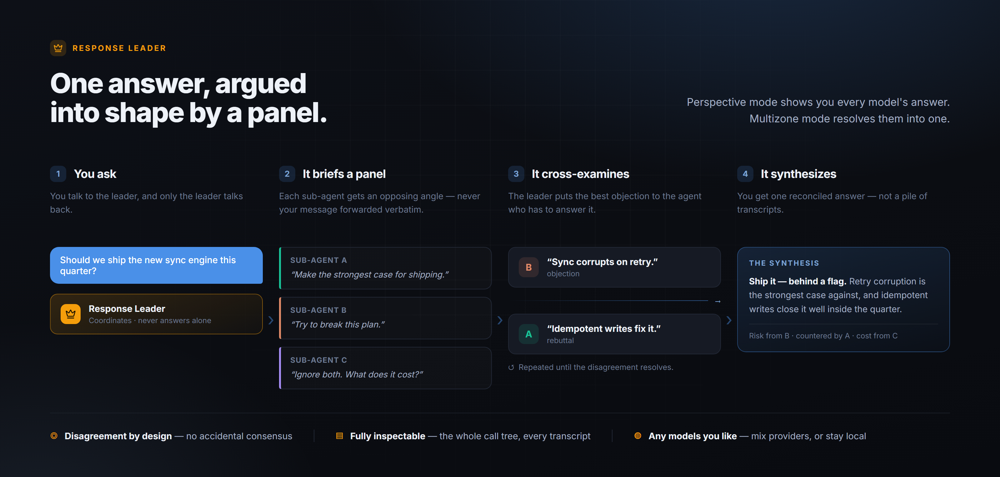

# MultiZone

A desktop LLM chat application built with Tauri + React + Rust. Supports multiple named "zones" (LLM configurations), perspective mode (send the same message to several zones simultaneously), projects, tags, file attachments, and an extensible tool system including web search.



Everything runs on your machine and talks directly to the providers you configure — there is no MultiZone account, and no server in the middle.

## Install

Download the latest MSI or NSIS installer from the [Releases](../../releases) page and run it. Windows 10/11 already ships the WebView2 runtime MultiZone needs.

Prefer to build it yourself? See [CONTRIBUTING.md](CONTRIBUTING.md).

## First run

On first launch, go to **Settings** to add a provider (any OpenAI-compatible API endpoint + key), then create a **Zone** pointing at that provider and choosing a model. The zone library also ships curated zones you can install in one action.

## Perspective mode

Each zone is its own provider, model, system prompt and toolset — a frontier API, a self-hosted endpoint, or a model on your own GPU. Add a zone as a *perspective* and every message you send fans out to all of them in parallel: one shared thread, independent replies you can read side by side. There is no fixed number — one zone or twenty, whatever you configure.



## Multizone mode — the Response Leader

Where perspective mode shows you every model's answer, Multizone mode resolves them into one. A zone flagged as a **Response Leader** doesn't answer from its own knowledge: it spawns a panel of sub-agent zones via `spawn_subagent`, briefs each one on a deliberately *opposing* angle rather than forwarding your message, cross-examines them against each other with `send_subchat_message`, and only then writes a single synthesized answer.

While a leader is driving them, sub-agents can't reach you — their `ask_user` calls are suppressed, since a question raised in a chat nobody is watching would wait forever. The whole leader → sub-agent call tree is inspectable inline in the stack tracer, with every subchat transcript openable, and you can open a subchat and **talk to the sub-agent yourself**: it takes messages like any other chat, exports like any other chat, and can ask *you* a question when you are the one who sent. Exporting the chat keeps them: sub-agent conversations are nested under the turns that spawned them in both the Markdown and PDF exports, with each turn attributed to the zone that wrote it, so a prompt from the leader is never presented as something you asked for. Turn it off under **Settings → Appearance → Chat export** when you only want the conversation you were part of.



Sub-agents don't have to run one at a time. `spawn_subagent`/`send_subchat_message` take `background: true`, which returns the subchat id immediately and runs that sub-agent on its own task — so a leader can put five specialists to work in a single message, keep reading code while they think, and pick every reply up with `collect_subagents`. `list_subchats` shows the sub-agents a conversation already has, and the leader is told to continue one rather than re-brief a fresh copy. Stopping the chat stops its background sub-agents with it.

Turn any zone into one with the **Response Leader** toggle in the zone editor (it auto-enables the subchat tools), or start from the curated "Response Leader" zone in the library.

### Working one codebase together

Sub-agents have always had the real tools — read, write, search, shell — and they inherit the parent chat's project directory. What they lacked was any way to know the others existed, which left only two safe patterns: run them one at a time, or have them hand patches back for someone else to apply. Agents working *against* each other, carefully sequenced.

The **teamwork** tool is the coordination layer that makes them work *alongside* each other instead:

- `claim_files` takes an advisory lock on the files an agent is about to edit, with a stated intent. A write to a file another agent holds is **refused by the tools**, so a claim isn't a convention someone can forget. An unclaimed write auto-claims, so the protection holds even for a zone that never calls the tool; claims expire, and release when the agent's turn ends, so a crashed agent can't own a file forever.
- `post_note` / `team_status` are the session's shared board. Parallel edits only compose if the decisions travel with them — "`parse()` returns None now instead of raising" has to reach whoever is editing the caller, and one sub-agent can't read another's transcript.

Reads are never blocked, and an ordinary single-zone chat never touches any of it.

### Zone teams

Some presets only work as a set. The library's **Teams** section installs one in a single action — a leader plus the specialists it delegates to, all bound to your default model.

The shipped **Code Team** is a general codebase collaboration: talk to **Code Team Lead** like a colleague about a symptom, a feature or a piece of code that annoys you, and it runs the team over your project. It clarifies the ask, has **Code Scout** map the ground, writes the contract the others must honour, then splits the work into file-disjoint slices that **Code Implementer (Careful)** (0.15) and **Code Implementer (Inventive)** (0.85) edit *at the same time* while **Code Test Author** writes the tests against the same contract — with **Code Reviewer** attacking the result and **Code Verifier** running the builds and suites on the combined tree. For a hard bug it switches to compete mode instead: both implementers attack the same problem independently, hand back diffs, and the leader picks on test evidence.

Seven zones on one model at seven temperatures: the value comes from independent attempts and adversarial review, not from a bigger model.

Every member is equipped like an agent you'd actually want on the job — web search and full page reads (an unfamiliar library's real API beats a half-remembered one), skills, the code runner, and shared memory at project scope, which is the durable counterpart to the board: how this repo's tests are run, or a trap someone hit, is injected into every agent on the project, including the ones spawned next week. Before a long run, set **Settings → Chat → Tool auto-approval** to *Everything* (a sub-agent cannot show you an approval prompt) and raise **Task length** to 60 or more.

## Web tools

Web research works out of the box with **no API key and no third-party search service**. Three tools (0.9.7+), based on [Hound](https://github.com/dondai1234/master-fetch):

| Tool | What it does |
|------|--------------|
| `smart_search` | Searches **seven keyless engines in parallel** — DuckDuckGo, Bing, Brave, Yandex, Ecosia, Yahoo, Wikipedia — and merges them with Reciprocal Rank Fusion, so a page several engines agree on ranks highest. If one engine is blocked or rate-limited the others still answer, and the result reports which engines contributed and which failed. |
| `smart_fetch` | Reads one or more pages **or PDFs** in full as clean markdown, boilerplate stripped, with an optional relevance query to trim a long page to what matters. |
| `smart_crawl` | Follows links within one site and reads several pages in a single call, visiting the most relevant first. |

All three run entirely from your machine, through a browser-emulating HTTP client that carries a real Chrome TLS/HTTP-2 fingerprint. There is **no headless browser**, so pages that render entirely via JavaScript — or that sit behind an interactive bot challenge — are reported as such rather than returned blank.

Enable them per-zone in the zone editor; they are on by default in the curated research zones.

### Legacy `web_search` / `extract_url`

The original single-engine tools are still available, mainly for the key-based providers. Configure under **Settings → Web search provider** (applies to every zone with the tool enabled):

| Provider | Requires | Notes |
|----------|----------|-------|
| `duckduckgo` | nothing | **Default.** Single-engine HTML scraping — prone to anti-bot challenges; prefer `smart_search`. |
| `searxng` | `endpoint` | Self-hosted SearXNG instance URL. |
| `brave` | `api_key` | [Brave Search API](https://api.search.brave.com/). |
| `tavily` | `api_key` | [Tavily](https://tavily.com/). |
| `serper` | `api_key` | [Serper](https://serper.dev/) (Google via API). |

## Terminals that stay open

`run_command` runs a command and waits for it to exit, which cannot express *starting* something — a dev server, a REPL, a log to follow, a program that asks a question part-way through. The **terminal** tool group (0.9.11) keeps a process alive between calls instead:

| Tool | What it does |
|------|--------------|
| `terminal_start` | Start a process (or a bare shell) and get back a short id (`t1`). Returns immediately; the process keeps running. |
| `terminal_write` | Type into it — a command, an answer to a prompt, a password. Returns only the output that followed. |
| `terminal_read` | Read what it has printed. Pass back the `cursor` from a previous call to get only what is new. |
| `terminal_list` | The conversation's terminals: label, whether each is alive, how much output is waiting. |
| `terminal_stop` | Stop one (or all) and return the final output. |

Driving an interactive program is a timing problem, so every call that can wait takes `delay_ms` (wait *before* typing — start a server, send the sudo password five seconds later), `wait_for` (a regex to wait for in the new output, with `timeout_ms`, reporting whether it matched), or `wait_ms` (collect for a fixed span).

Reader tasks drain stdout and stderr continuously, so output printed *between* tool calls is still there when you look; ANSI escapes are stripped and a `\r`-redrawn progress line collapses to where it landed. Terminals are visible to the whole session — a leader's dev server is one its own sub-agents can query — and are never reaped on idle: they end when stopped, when the process exits, or when the app closes.

stdin/stdout are **pipes, not a PTY**. Servers, build tools and REPLs work; programs that insist on a real terminal do not — pass `sudo -S`, expect `ssh` password prompts and full-screen TUIs to fail, and stop a process with `terminal_stop` rather than trying to send Ctrl-C. Children block-buffer on a pipe, so unbuffer where it matters (`python -u`, `stdbuf -oL`); `PYTHONUNBUFFERED` is set for you.

## Editing a message

Hover any message and hit **Edit**. The editor is the composer you already use: the same box, the same paperclip, the same microphone, with the message's attachments shown as chips above it. Remove one and it is gone from the resent turn; drop another in — or paste a screenshot — and it goes with it. Editing one of your own turns re-runs the conversation from that point; editing an answer just corrects the text in place.

## Voice dictation

Dictate instead of typing (0.8.0+). Transcription goes to a provider you configure under **Settings → Voice**, using the OpenAI-compatible `/audio/transcriptions` endpoint — so pointing it at a local server (e.g. LM Studio serving a whisper model) keeps your audio on your machine.

Dictation behaves like typing: start a recording with text selected and what you say **replaces the selection**, leaving the caret after it. With nothing selected, the transcript is inserted at the cursor — unless **Settings → Voice → Insertion mode** is set to *Replace field*, which always overwrites the whole composer.

## Appearance

**Settings → Appearance** covers the palette, fonts, bloom and shadows, plus an animated **background effect** — every one of which reacts to your cursor, and none of which need it to keep moving:

| Effect | What it does |
|--------|--------------|
| Particles | A drifting field wired together by proximity lines; the cursor pushes them aside. |
| Orbs | Slow layered colour clouds that swirl, bloom and drift apart under the cursor. |
| Aurora | Curtains of light rippling across the top of the screen, bending toward the cursor. |
| Grid | A pulsing grid with a highlight band sweeping across it. |
| Stars / Shooting stars | A parallax starfield, optionally streaked by meteors. |
| Waves | Layered sine curves that rise and fall with the pointer. |
| Fireflies | Wandering lights that pulse and drift gently toward the cursor. |
| Boids | A flock that aligns, crowds and scatters from the cursor like a predator. |
| Matrix | Falling glyph rain that fades behind itself; the cursor burns the columns it passes brighter. |
| Topography | Breathing contour lines of a slowly morphing landscape, with the cursor pushing a hill into it. |
| Puzzle | An interlocking jigsaw where pieces near the cursor lift, tilt and light up. |
| Mountains | Parallax ridgelines under a drifting sun or moon, with a starfield above. |
| Fish | Procedurally animated fish — jointed spines that swim with fins and a trailing tail — schooling, and darting away when you get close. |

Four sliders shape whichever you pick: **Speed**, **Density**, **Opacity**, and **Hue variation**, which spreads each element's colour around your accent instead of painting everything one flat tone. Leave it at 0 for a single-colour look.

### Custom CSS

**Settings → Appearance → Custom CSS** (0.11.3) takes a stylesheet of your own, loaded after the app's — so an equally specific rule wins and you don't have to reach for `!important`. It has its own on/off switch, which matters more than it sounds: a rule that hides the wrong thing can be switched off without first finding it in the text.

Write colours as the theme's variables (`--color-bg`, `--color-panel`, `--color-panel-hover`, `--color-border`, `--color-text`, `--color-text-muted`, `--color-accent`) rather than as literals, or the sheet breaks the moment you switch between light and dark.

```css
.sidebar { width: 220px; }
button { border-radius: 2px; }
```

Everything in this section — the palette, the effects and the custom sheet — is also reachable over the API and by the assistant itself; see [`/api/theme`](#http-api) below.

## Connectors (MCP)

**Settings → MCP → Browse catalog.** A catalog entry carries everything about a Model Context
Protocol server except the part only you have: the command or URL, the environment variables or
headers it needs, what has to be installed first, and a link to the page each credential comes
from. Installing one writes the server and stops — nothing is launched or contacted until you
press **Connect**, and then you set a danger level per tool and enable the ones you want per zone.

The shipped set covers Gmail, GitHub, Context7, Tavily search, the reference filesystem server and
Playwright. It is a JSON file, not code: **Import entries from a URL** adds more (one entry, a list,
or `{ "entries": [...] }`), they land as files in the app's `connectors/` folder, and an imported
entry sharing an id with a shipped one replaces it.

Hosted servers authenticate. MultiZone sends the **Headers** you configure with every request on the
sse/http transport, which is where an `Authorization: Bearer …` goes — catalog entries fill it in
from a pasted token, and the manual editor has the field. Google's
[Gmail MCP server](https://developers.google.com/workspace/gmail/api/guides/configure-mcp-server) is
the worked example: enable the two APIs on a Cloud project, set up the consent screen with the
`gmail.readonly` and `gmail.compose` scopes, then paste an access token from
`gcloud auth print-access-token` into the catalog entry. Google's tokens last about an hour, so this
is paste-again-when-it-expires until signed-in connectors (OAuth with refresh, per-scope consent,
tokens in the OS keychain) land after 1.0.

**Diagnose** answers the question "why isn't this working" properly. It runs the checks in the order
they can fail — is the server enabled, is there a command, is that program on the PATH the app
inherited, are the values the catalog marks required actually filled in, and only then the handshake
— and reports the first false one with what to do about it. A stdio server's own stderr is captured
and quoted, so "the command ran, the server exited, `GOOGLE_CREDENTIALS_PATH` is not set" replaces
"failed to connect".

The assistant can do all of this except the writes: `app_read` reaches the catalog and the
diagnosis, so "why can't you see my email?" is answerable, while installing a connector goes through
`app_control` and therefore through an approval prompt. Silently adding a server that launches a
process is exactly what an injected instruction would ask for.

## HTTP API

MultiZone can expose a local HTTP API so external tools or scripts can drive it like a CLI — listing and creating chats, picking zones/projects, and sending messages with the same agentic loop the GUI uses.

Enable it under **Settings → API**: toggle it on, optionally change the port, and copy the auto-generated bearer token. The server binds to `127.0.0.1` only and every request must include `Authorization: Bearer <token>`.

Base URL: `http://127.0.0.1:8765` (default port).

**The API describes itself, so this table cannot be the only record of it.** Two routes answer without a token, because a caller working out why nothing else responds should not have to authenticate to find out that its token is the problem:

| Method | Endpoint | Description |
|--------|----------|-------------|
| `GET` | `/api/routes` | Every route this build serves, with a one-line description each. |
| `GET` | `/api/health` | `enabled` · `bound` · `answering` · `tokenPresent` · `tokenAccepted`, plus the app version and route-set version. Five separate questions with five separate answers — if you cannot reach the app, this tells you which one is false. |

Everything else needs the bearer token. Rather than reproduce the whole surface here — where it would go stale, as it did — ask the app:

```bash
curl http://127.0.0.1:8765/api/routes | jq -r '.routes[] | "\(.method)\t\(.path)\t\(.description)"'
```

The surface covers chats and messages, zones, providers, projects, tags, perspectives and sub-agents, skills, memory, MCP servers, knowledge indexes, checkpoints and the review queue, tool and token usage, settings, and the markdown mirror — reads and writes both, so a script can provision the app rather than only drive it. A test pairs every Tauri command with either a route or an explicit "GUI-only" reason, so a new capability cannot ship API-invisible without failing the build.

The most-used handful:

| Method | Endpoint | Description |
|--------|----------|-------------|
| `GET` | `/api/chats` | List chats. |
| `POST` | `/api/chats` | Create a chat. Body: `{ "zoneId"?, "projectId"? }`. |
| `GET` | `/api/chats/:id/messages` | List a chat's messages. |
| `POST` | `/api/chats/:id/messages` | Send a message (see below). |
| `POST` | `/api/chats/:id/regenerate` | Re-run the last turn. |
| `POST` | `/api/chats/:id/cancel` | Cancel the in-flight stream. |
| `POST` | `/api/chats/:id/zone` | Set the primary zone. Body: `{ "zoneId" }`. |
| `POST` | `/api/chats/:id/approval` | Answer a pending tool approval. Body: `{ "approved", "zoneId"?, "hunks"? }`. |
| `GET`/`POST`/`DELETE` | `/api/chats/:id/perspectives` | List/add/remove perspective zones. Body for add/remove: `{ "zoneId" }`. |
| `GET` | `/api/zones` · `/api/projects` · `/api/tags` | List each. `POST` to create or update; `DELETE /:id` to remove. |
| `PATCH` | `/api/settings/:key` | Merge fields into a JSON settings row — `PATCH /api/settings/theme -d '{"mode":"dark"}'` switches to dark mode without re-sending every other appearance setting. `PUT` still writes a row whole. |
| `GET`/`PATCH` | `/api/theme` | The appearance settings in force, plus a schema for them: every field with its type, range, default and meaning, and the palette-key ↔ CSS-variable table. `PATCH` validates what you send and names what is wrong with a patch it rejects, rather than writing a misspelled field and reporting success. |

Sending a message accepts either `{ "text": "..." }` or `{ "parts": [...] }` (the same content parts the GUI uses). By default the response is a [Server-Sent Events](https://developer.mozilla.org/en-US/docs/Web/API/Server-sent_events) stream of the same events the GUI receives (tokens, tool calls, etc.). Append `?wait=true` to instead block until the turn finishes and return the final messages as JSON.

```bash
# Create a chat with a specific zone
curl -X POST http://127.0.0.1:8765/api/chats \
  -H "Authorization: Bearer YOUR_TOKEN" \
  -H "Content-Type: application/json" \
  -d '{"zoneId":"<zone-id>"}'

# Send a message and stream the response (SSE)
curl -N -X POST http://127.0.0.1:8765/api/chats/<chat-id>/messages \
  -H "Authorization: Bearer YOUR_TOKEN" \
  -H "Content-Type: application/json" \
  -d '{"text":"Hello"}'

# Send a message and wait for the final result as JSON
curl -X POST "http://127.0.0.1:8765/api/chats/<chat-id>/messages?wait=true" \
  -H "Authorization: Bearer YOUR_TOKEN" \
  -H "Content-Type: application/json" \
  -d '{"text":"Hello"}'
```

API-driven activity also updates any matching chat open in the app live — and so does everything else it writes. A zone created over the API appears in the sidebar, and a theme changed over it is the theme you are looking at, without a restart.

### Letting the assistant drive the app

The **Change MultiZone itself** tool group (`app_control`, 0.11.0) gives the model the same surface:

| Tool | What it does |
|------|--------------|
| `app_read` | `GET` any API path. Start with `/api/routes` — that is the model's catalog of what it can do. |
| `app_control` | `POST` / `PUT` / `PATCH` / `DELETE` any API path. Every call goes through an approval prompt. |

Both serve the request through the same router the socket does, in-process — so the tool needs no port, works whether or not the HTTP API is switched on, and cannot reach anything the API cannot. "Switch to dark mode", "make me a zone for code review", "file this chat under the Rewrite project" are then things the assistant does rather than describes.

Two routes are refused from inside a turn: sending or regenerating a message (a turn calling itself — that is what the `subchat` tool is for, under your supervision), and answering a tool approval (the model granting itself permission). The group is classed dangerous, so it never lands in a default toolset.

## Contributing

Build instructions, project layout and conventions are in [CONTRIBUTING.md](CONTRIBUTING.md).

## License

[Apache License 2.0](LICENSE).
